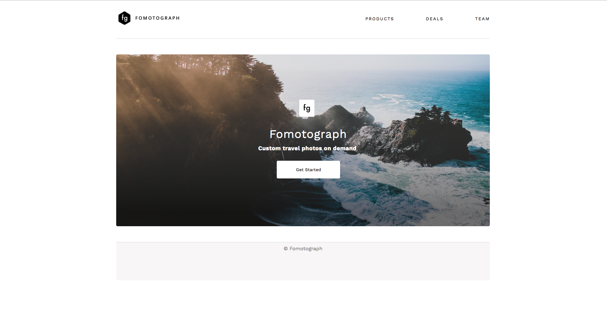

# Fomotograph

Fomotograph is a practice tutorial to understand MVC design pattern in Ruby. [Sinatra](http://sinatrarb.com/) is the Ruby web framework used in this project. I followed a free course on Udacity to complete this project. Here's the [link](https://classroom.udacity.com/courses/ud270) to the course on Udacity.

## Getting Started
- Install [Ruby](https://www.ruby-lang.org/en/downloads/) on your machine.

- Clone the repository.

- Change directory into the root of the project directory.

- Install Bundler using `(sudo) gem install bundler`.

- Run `bundle install` to install all the required gems for the project.

- Run the Sinatra app using the command `ruby app.rb`.

- Visit `http://localhost:4567` on your browser to view the app.
